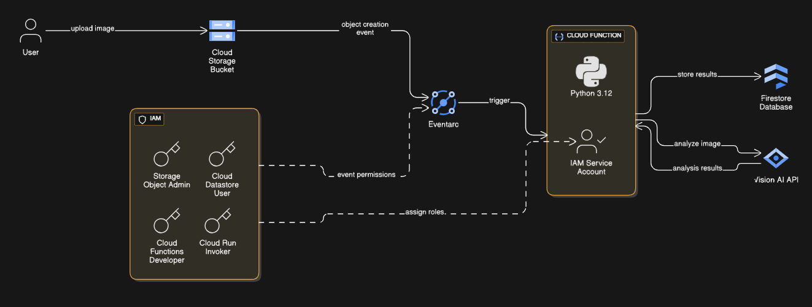

# 📷 GCP Serverless Image Analysis Pipeline

A fully automated, event-driven, and serverless image analysis pipeline built on **Google Cloud Platform (GCP)**. When a new image is uploaded to a Cloud Storage bucket, a Cloud Function is triggered to analyze the image using **Vision AI API**, and the structured results are stored in **Firestore** for further use.

---

## 🎬 Live Demo

This GIF demonstrates the end-to-end flow: an image is uploaded to the Cloud Storage bucket, and the resulting analysis data appears instantly in the Firestore database.

 <!-- Replace with actual path to your GIF -->

---

## ✨ Key Features

- **Serverless Architecture**  
  No servers to manage. Automatically scales from zero to thousands of requests.

- **Event-Driven**  
  Triggered automatically by file uploads to Cloud Storage.

- **AI-Powered Analysis**  
  Uses Google’s pre-trained Vision AI model for high-accuracy image labeling.

- **Secure by Default**  
  Implements fine-grained IAM roles and a dedicated service account for minimal privilege access.

---

## 🧰 Technologies Used

| Category          | Technology                         |
|-------------------|-------------------------------------|
| Compute           | Cloud Functions (2nd Gen)          |
| Storage           | Cloud Storage, Firestore (NoSQL)   |
| AI/ML             | Cloud Vision AI API                |
| Event Handling    | Eventarc                           |
| Security          | Identity and Access Management     |
| Language          | Python 3.12                        |

---

## 🗺️ Architecture Diagram

This diagram illustrates the end-to-end data flow and the interaction between GCP services.

 <!-- Replace with actual path -->

---

## 🔍 How It Works

1. **Image Upload**  
   A user uploads an image (e.g., `.jpg`, `.png`) to a specified Cloud Storage bucket.

2. **Event Detection**  
   An Eventarc trigger detects the object creation event.

3. **Function Execution**  
   The Python-based Cloud Function is invoked with metadata (bucket name, file name).

4. **Vision API Call**  
   The function sends the image to Vision AI for label detection.

5. **Data Storage**  
   The labels and image metadata (e.g., timestamp, file path) are stored as a document in Firestore.

---

## 🚀 Setup & Deployment

To replicate and run this project, you’ll need a GCP account with billing enabled.

---

### ✅ 1. Prerequisites

- Google Cloud SDK installed and authenticated (`gcloud init`)
- A GCP project with the following APIs enabled:
  - `cloudfunctions.googleapis.com`
  - `storage.googleapis.com`
  - `vision.googleapis.com`
  - `firestore.googleapis.com`
  - `cloudbuild.googleapis.com`
  - `run.googleapis.com`
  - `eventarc.googleapis.com`

---

### 🏗️ 2. Create Required Resources

- Create a **Cloud Storage** bucket (e.g., `image-input-bucket`)
- Create a **Firestore** database in **Native mode**
- Create a **dedicated service account** with the following IAM roles:
  - Storage Object Admin
  - Cloud Datastore User
  - Eventarc Event Receiver
  - Cloud Functions Developer
  - Cloud Run Invoker

---

### ☁️ 3. Deployment Methods

#### 🖥️ Method 1: Google Cloud Console (GUI)

1. Go to **Cloud Functions** in the GCP Console
2. Click **“+ CREATE FUNCTION”**
3. Set the environment to **2nd gen**
4. Choose a name, region, and configure the trigger:
   - Event Type: `google.cloud.storage.object.v1.finalized`
   - Bucket: your input bucket
5. In **Runtime, Build & Connections**, select:
   - Runtime: `Python 3.12`
   - Entry Point: `process_image`
   - Runtime service account: your custom IAM service account
6. In the **inline editor**, add your `main.py` and `requirements.txt`
7. Click **Deploy**

---

#### 💻 Method 2: Google Cloud SDK (CLI)

1. Clone this repository
2. Navigate to the root directory
3. Run the following command (replace placeholders):

```bash
gcloud functions deploy process-image-function \
  --runtime python312 \
  --trigger-resource YOUR_BUCKET_NAME \
  --trigger-event google.storage.object.finalize \
  --entry-point process_image \
  --region YOUR_REGION \
  --service-account YOUR_SERVICE_ACCOUNT_EMAIL
